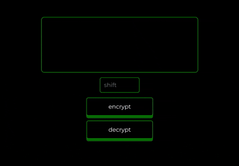
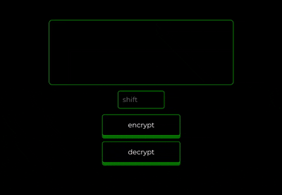

# Caesar Cipher Encoder/Decoder

A simple desktop tool to encrypt and decrypt Caesar cipher in English and Russian using a dictionary-based approach, built with Electron

- [dwyl/english-words](https://github.com/dwyl/english-words) — English word list
- [danakt/russian-words](https://github.com/danakt/russian-words) — Russian word list
